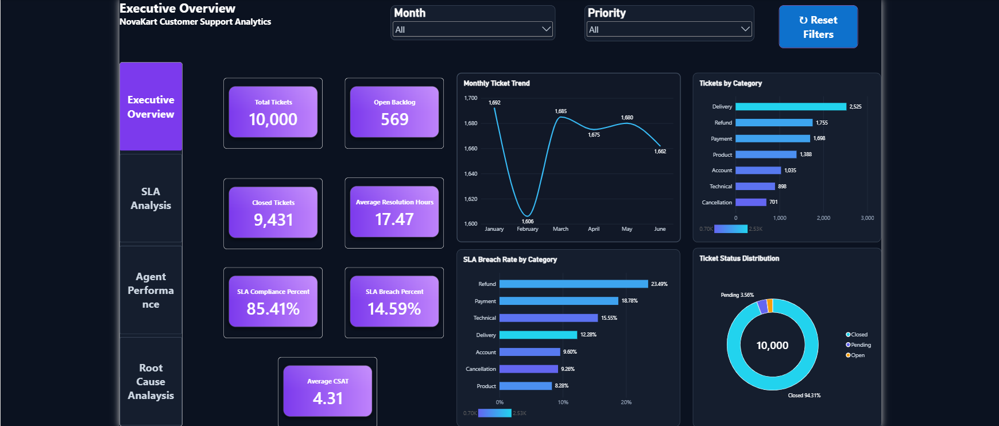
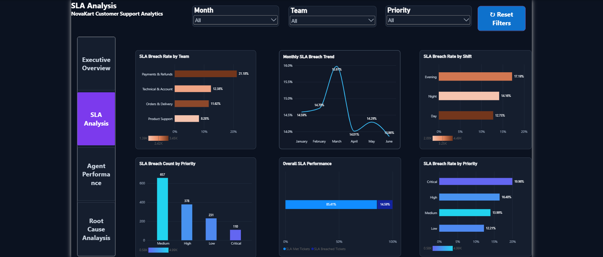
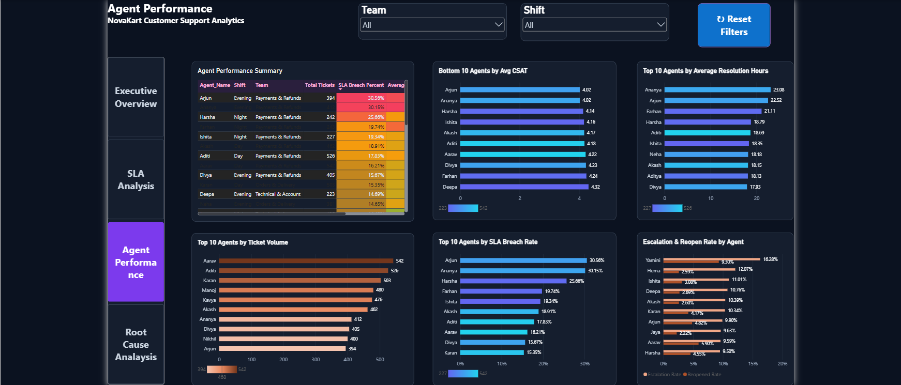
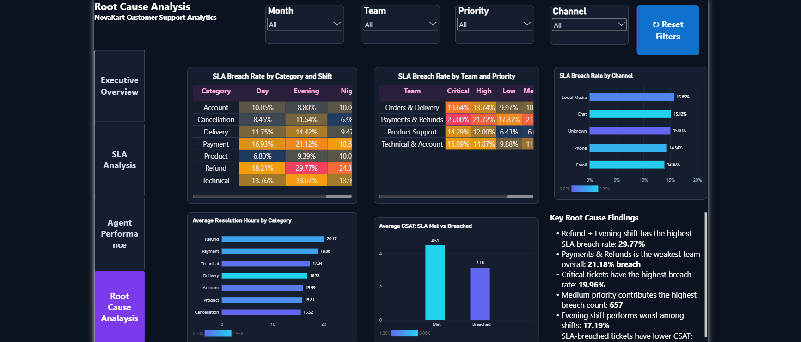

# NovaKart Customer Support Analytics

### Customer Support Operations & SLA Performance Analytics

**SQL Server | Excel / Power Query | Power BI | Business Analysis**

An end-to-end analytics portfolio project using a fictional e-commerce customer-support dataset. The project demonstrates data cleaning, SQL analysis, data modeling, DAX, interactive dashboard development, and business requirements documentation.

## Business Problem

NovaKart's support management needs a consolidated view of ticket volume, unresolved backlog, SLA compliance, customer satisfaction, and agent performance.

The objective is to identify high-risk operational segments and support evidence-based decisions on workload distribution, process improvement, and service quality.

## Project Overview

| Item | Details |
|---|---|
| Dataset | 10,000 fictional support tickets |
| Period | January–June 2026 |
| Tools | Excel, Power Query, SQL Server, SSMS, Power BI |
| Data model | Tickets, Agent Master, SLA Master, Date Table |
| Dashboard | 4 interactive pages |
| Documentation | Business Requirements Document |

## Project Workflow

Raw Excel Data
→ Power Query Cleaning
→ SQL Server
→ SQL Analysis
→ Power BI Dashboard
→ Business Requirements Document
→ GitHub Portfolio

## Dashboard Pages

| Page | Purpose |
|---|---|
| Executive Overview | Monitor ticket volume, backlog, SLA performance, monthly trends, and category distribution. |
| SLA Analysis | Compare SLA breaches by team, shift, priority, and month. |
| Agent Performance | Review agent workload, SLA breach rate, resolution time, CSAT, escalation, and reopen performance. |
| Root Cause Analysis | Investigate category–shift and team–priority combinations and compare CSAT by SLA status. |

## Key Findings

| Finding | Result |
|---|---:|
| Total Tickets | 10,000 |
| Closed Tickets | 9,431 |
| Open Backlog | 569 |
| Resolution SLA Compliance | 85.41% |
| Resolution SLA Breach | 14.59% |
| Average Resolution Hours | 17.47 |
| Average CSAT | 4.31 |
| Highest-breach category | Refund — 23.49% |
| Highest-breach team | Payments & Refunds — 21.18% |
| Highest-breach shift | Evening — 17.19% |
| Highest-risk category–shift combination | Refund + Evening — 29.77% |
| Average CSAT: SLA Met vs Breached | 4.51 vs 3.16 |

**Business interpretation:** Refund-related operations, particularly during the Evening shift, are priority areas for further investigation. SLA-breached tickets are associated with lower customer satisfaction, although the analysis does not establish causation.

## Data Cleaning & Validation

The cleaning process included:

- Standardizing text fields and city names.
- Handling missing Channel values as `Unknown`.
- Removing exact duplicate ticket records.
- Preserving legitimate missing resolution and CSAT values.
- Correcting CSV time-import artifacts.
- Validating unique ticket IDs and master-table relationships.

The final SQL validation confirmed 10,000 tickets, 36 agents, and 4 SLA priority records, with no duplicate ticket IDs or unmatched Agent_ID/Priority values.

## Repository Structure

The project files are organized into the following folders:

| Folder | Contents |
|---|---|
| `01_Raw_Data` | Original fictional source workbook |
| `02 - Cleaned_Data` | Cleaned Excel workbook and CSV files |
| `03 -SQL` | Database setup and SQL analysis scripts |
| `04 -Power_BI` | Completed Power BI dashboard |
| `05_Business_Requirements` | Business Requirements Document |

The repository also contains this `README.md` file.

## How to Explore the Project

The SQL scripts document the database setup and analytical queries. The cleaned data files are provided for reviewing the transformation and analysis workflow.

The Power BI report uses an Import connection to a local SQL Server database. To refresh it on another computer, configure the SQL Server connection and load the required data into the corresponding tables.

The PBIX can also be opened to review the report design, data model, DAX measures, and existing imported data.

## Portfolio Disclaimer
NovaKart E-Commerce Pvt Ltd and the dataset are fictional. This project demonstrates analytical and business-analysis skills and does not represent results from a real company or production deployment.

## Dashboard Preview

### Executive Overview

### SLA Analysis

### Agent Performance

### Root Cause Analysis

NovaKart E-Commerce Pvt Ltd and the dataset are fictional. This project demonstrates analytical and business-analysis skills and does not represent results from a real company or production deployment.
